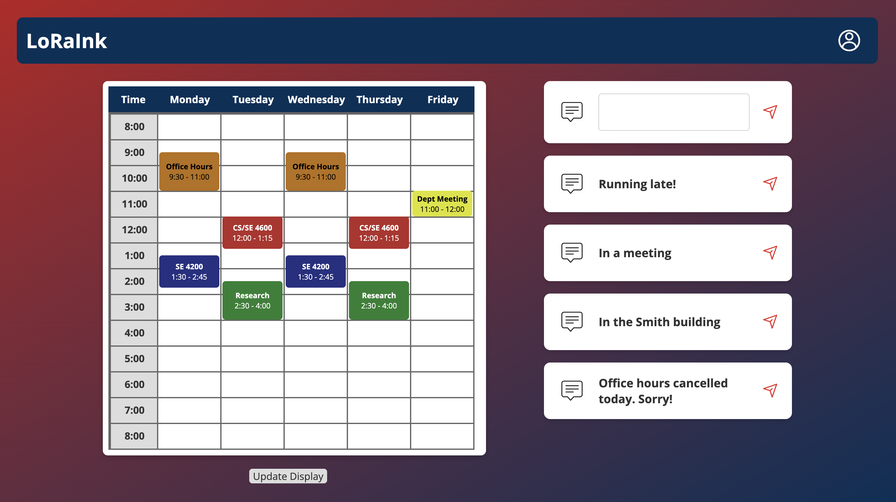
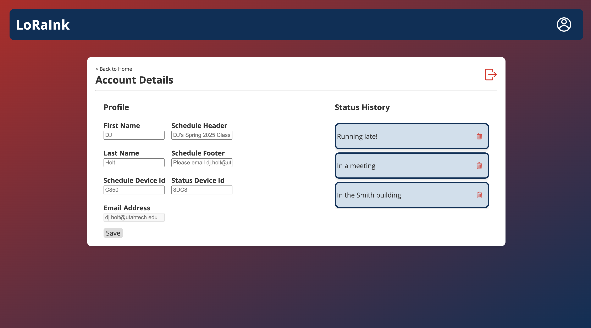
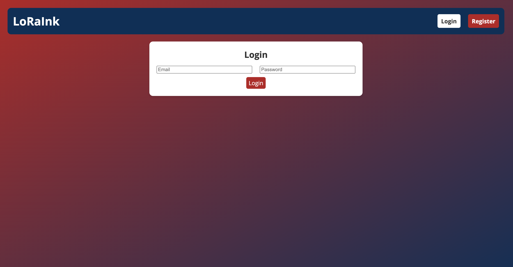
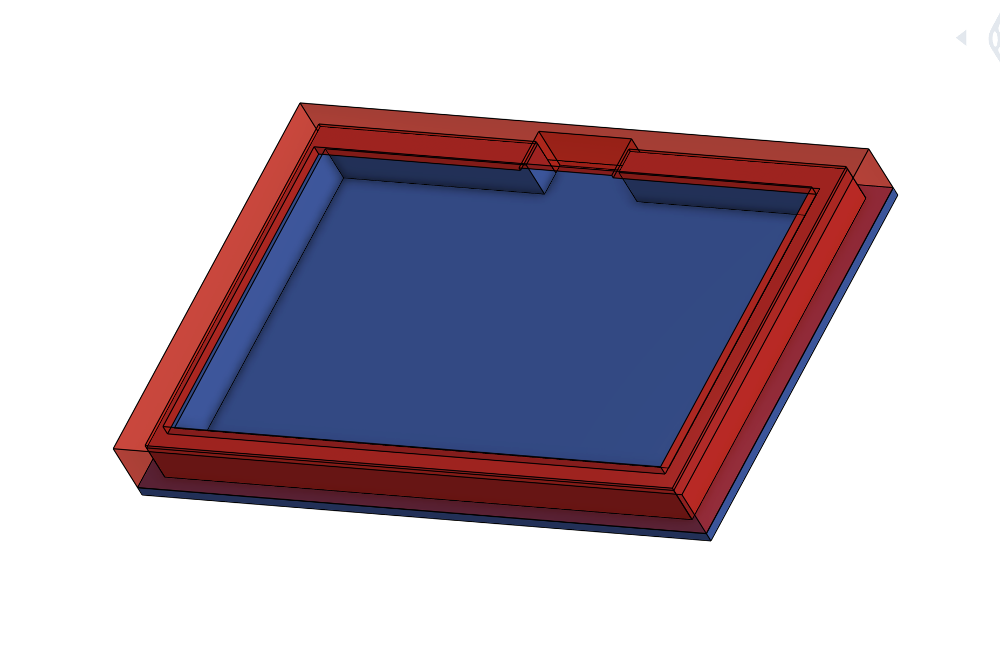
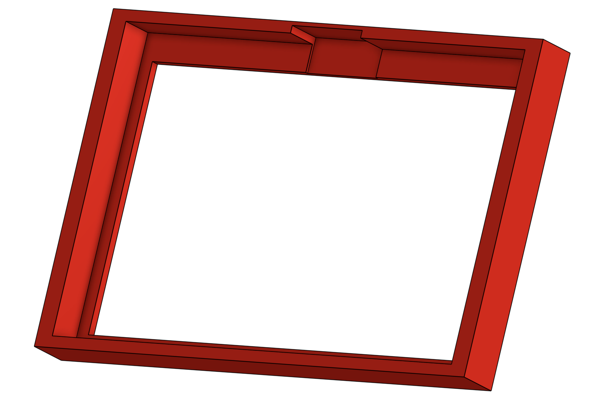
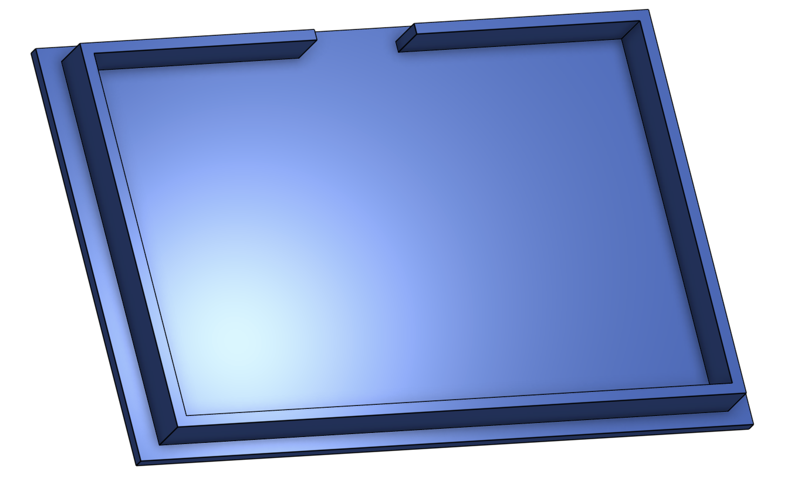
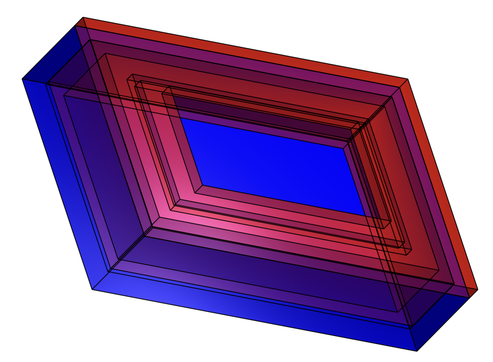
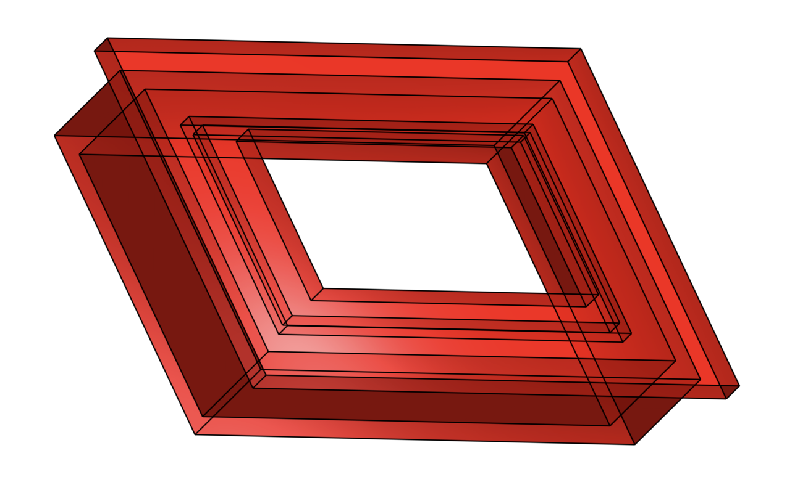
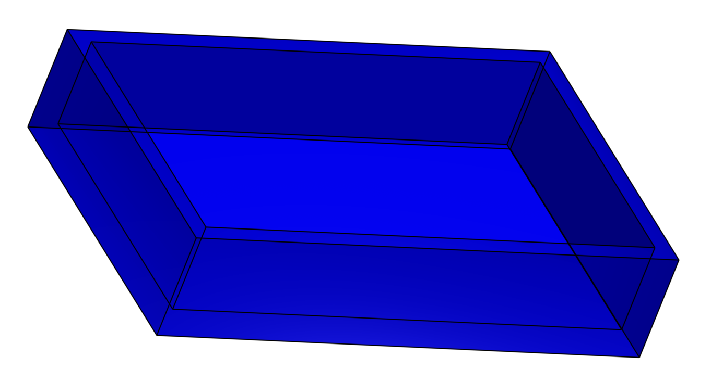
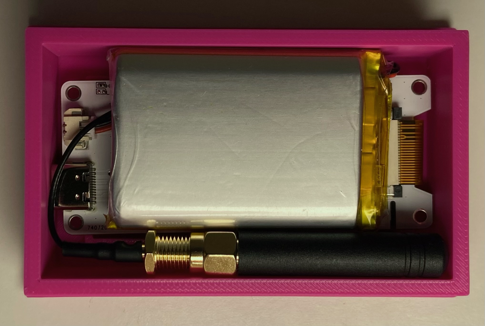

# LoraInk - For Low Power Digital Signage

## Overview

This project addresses the inefficiencies of traditional paper signage for office hours and meeting room schedules at Utah Tech University by implementing a digital solution using a web application and low power E-ink displays. Professors can manage their weekly schedules and send real time status updates via a web interface, which are then displayed on E-ink screens outside their offices.

**Hardware:** Custom PCB with Waveshare 7.3inch ACeP 7-Color E-Paper, Heltec Wireless Paper, ESP32 microcontrollers, SX1262 LoRa radio modules, LiPo batteries, 3D printed enclosures.

**Software:** Vue.js, Node.js, Express, and MongoDB for front end developement. Arduino code that uses ArduinoWebsockets, ESP32 WiFi, RadioLib, and ESP Sleep for firmware. OnShape for modeling 3D enclosures.

## Features

* **User Accounts and Profiles:** Professors can create secure accounts where they can enter and save their schedule, status, and profile data.
* **Centralized Web Application:** Professors can input and manage their weekly schedules and send more timely status updates.
* **Real-time Updates:** Status and schedule changes are pushed to E-ink displays in real time via WebSockets.
* **Recurring Events:** Scheduling supports the creation of recurring events across multiple days.
* **Color Coded Schedule:** Users can assign colors to schedule events, matching the E-ink display capabilities.
* **Device Identification:** System ensures messages are routed to the correct E-ink displays using thier unique hardware IDs.
* **Low Power Consumption:** E-ink display's ESP32 chips utilize deep sleep modes for extended battery life.
* **Wireless Communication and Packet Handling:** Uses Wi-Fi for server communication and LoRa messages in predefined packet type structs for reliable communication with E-ink displays.
* **Custom Enclosures:** 3D printed enclosures provide a professional deployment for the hardware.
* **Data Management:** MongoDB database stores user data, schedules, and status messages.

## Technical Details

* **Web Application:** Vue.js frontend communicating via HTTP requests with a Node.js and Express backend, using MongoDB for data storage and WebSockets for real-time communication with the ESP32. Deployed on Railway.
* **ESP32 Central Node:** Arduino-based client managing WebSocket connection with the server and LoRa communication with the displays. Formats and transmits data packet structs based on message type.
* **E-ink Displays:** ESP32 controlled devices listening for LoRa packets. The Heltec Wireless Paper displays status messages, while the Waveshare 7-Color display with custom PCB renders the weekly schedule and user's specified header and footer. Both implement power saving deep sleep modes.
* **Wireless Communication:** Utilizes Wi-Fi and Websockets for server to ESP32 communication and LoRa for ESP32 to display communication, employing custom packet structs for efficient data transfer.

## Data Model
**MongoDB Resources:**

* **ScheduleEvent:**
    ```javascript
    {
        DayOfTheWeek: Number,
        StartTime: String,
        EndTime: String,
        Description: String,
        Color: String,
        user: ObjectId (reference to User)
    }
    ```
* **StatusMessage:**
    ```javascript
    {
        Content: String,
        LastUsed: Date,
        user: ObjectId (reference to User)
    }
    ```
* **User:**
    ```javascript
    {
        firstName: String,
        lastName: String,
        scheduleNodeId: String,
        statusNodeId: String,
        scheduleHeader: String,
        scheduleFooter: String,
        email: String,
        encryptedPassword: String
    }
    ```

**Arduino Data Structs:**

```c++
#define PACKET_TYPE_WAKEUP 0xA1
#define PACKET_TYPE_HEADER_FOOTER 0xB2
#define PACKET_TYPE_EVENT 0xC3
#define PACKET_TYPE_STATUS 0xD4
#define PACKET_TYPE_SYNC 0xE5

struct SyncCountData {
  uint16_t eInkId;
  uint8_t eventCount;
};
struct EventData {
  uint16_t eInkId;
  uint8_t dayOfWeek;
  uint16_t startTimeMinutes;
  uint16_t endTimeMinutes;
  uint8_t backgroundColor;
  char description[32];
};
struct HeaderFooterData {
  uint16_t eInkId;
  uint8_t headerLength;
  char header[100];
  uint8_t footerLength;
  char footer[100];
};
struct StatusMessageData {
  uint16_t eInkId;
  char message[150];
};
```
## Key Functionalities

* **User Account Management:** Creation, login, and updating of professor accounts with device ID registration.
* **Status Message Handling:** Creation, sending, history management, and real time display of status updates.
* **Schedule Event Management:** Adding, updating, deleting, and recurring scheduling of office hour events with screen compatible color selection and real time updates.
* **Data Persistence:** Storing and retrieving user, status, and schedule data using MongoDB.
* **Wireless Data Transmission:** Sending status and schedule data from the web application to the E-ink displays via WebSockets and LoRa.
* **Power Management:** Utilize the **ESP Sleep library** for implementing deep sleep modes to minimize power consumption.
* **E-ink Display Rendering:** Displaying status messages and color-coded schedules on the remote devices with efficient power management.

## Visuals
* **Web Interface**
    * Interactive Schedule and Recent Status Message Shortcuts <br>
     <br>
    * Account Details Page with Status History <br>
     <br>
    * Account Login and Register Page <br>
     <br>

* **3D Models** 
    * CAD render of the large display <br>
     <br>
    
     
    <br>
    * CAD render of small display <br>
     <br>
    
    
    <br>
* **Hardware Assembly**
    * Displays <br>
     <br>
    * The large display contains Waveshare 7.3 inch 7-Color ACeP Display, Driver Board and FFC cable, LoRa antenna, 10,000 mAh LiPo battery, and custom PCB with SX1262 LoRa chip and ESP32 chip. <br>
     <br>
    * The small display contains a Heltec Wireless Paper board with SX1262 LoRa chip and ESP32 chip, a LoRa antenna, and a 2000 mAh LiPo battery. <br>
    
    

## References and Libraries
* [Arduino Display Library for SPI E-Paper Display](https://github.com/ZinggJM/GxEPD2?tab=readme-ov-file)
* [ESP Sleep Library](https://github.com/pycom/pycom-esp-idf/blob/master/components/esp32/include/esp_sleep.h)
* [Heltec Wireless Paper Examples and Demos](https://github.com/todd-herbert/heltec-eink-modules/tree/main/examples/Wireless%20Paper)
* [Radio Lib Library for SX1262 LoRa Radio](https://github.com/jgromes/RadioLib/tree/master/examples/SX126x)
* [ArduinoWebsockets Library for ESP32 Client](https://github.com/gilmaimon/ArduinoWebsockets/blob/master/examples/Esp32-Client/Esp32-Client.ino)
* [DJ Holt - Custom PCB Creation](https://github.com/djholt)

